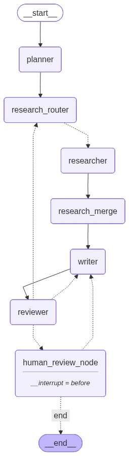

# 🤖 基于 LangGraph 的多智能体深度行业研报生成系统

[](https://www.python.org/)
[](https://www.langchain.com/langgraph)
[](https://fastapi.tiangolo.com/)
[](https://streamlit.io/)
[](LICENSE)

> 一个智能化的行业研究助手，能够自动完成**规划、检索、写作与审核**全流程，并支持**人在回路 (Human-in-the-loop)** 的交互式反馈与优化。

---

## ✨ 核心特性

- **🤖 多智能体协作**：Planner（规划）、Researcher（检索）、Writer（写作）、Reviewer（审核）分工明确，高效协同。
- **🧠 深度推理与反思**：基于 LangGraph 的 StateGraph 架构，支持循环迭代与自我修正。
- **🔄 人在回路 (HITL)**：关键节点支持人工介入（Approve/Reject），确保生成内容的准确性与可控性。
- **⚡ 实时流式体验**：后端采用 FastAPI SSE 推送，前端 Streamlit 实时展示思考过程与日志。
- **📚 强大的检索能力**：集成 Tavily Search（优先）与 DuckDuckGo，确保信息来源的时效性与广度。
- **💾 完善的持久化**：基于 SQLite 的 Checkpoint 机制，支持断点续传与历史回溯。

## 🏗️ 系统架构

系统采用微服务架构，前后端分离设计：



*图：Agent 工作流状态机可视化*

- **Agent Layer**: LangGraph 驱动的智能体工作流。
- **API Layer**: FastAPI 提供 RESTful 接口与 SSE 流服务。
- **UI Layer**: Streamlit 提供友好的交互界面。

## 🚀 快速开始

### 前置条件

- Python 3.10+
- [DashScope API Key](https://help.aliyun.com/zh/dashscope/developer-reference/activate-dashscope-and-create-an-api-key) (支持 Qwen/DeepSeek 等模型)
- [Tavily API Key](https://tavily.com/) (推荐，用于高质量搜索)

### 1. 安装依赖

```bash
git clone https://github.com/shihan-1147/langgraph-multi-agent-research-report.git
cd langgraph-multi-agent-research-report
pip install -r requirements.txt
```

### 2. 配置环境

在项目根目录创建 `.env` 文件：

```env
# 必填
DASHSCOPE_API_KEY=sk-your-api-key

# 选填（推荐用于增强搜索能力）
TAVILY_API_KEY=tvly-your-api-key
```

### 3. 启动服务

你需要打开两个终端分别启动后端和前端。

**终端 1：启动后端 API**

```bash
uvicorn backend.main:app --host 0.0.0.0 --port 8000
```

**终端 2：启动前端 UI**

```bash
streamlit run frontend/app.py
```

### 4. 开始使用

1. 访问浏览器：`http://localhost:8501`
2. 在侧边栏输入研究主题（例如：“**2025年生成式AI在医疗领域的应用趋势**”）。
3. 点击 **开始研究**。
4. 观察 Agent 的实时思考与执行过程。
5. 在审核阶段提供反馈或直接通过。

## 📂 项目结构

```text
.
├── agent/                  # 🤖 Agent 核心逻辑
│   ├── graph.py            # LangGraph 图定义
│   ├── nodes.py            # 节点功能实现
│   ├── prompts.py          # Prompt 模板
│   └── states.py           # 状态定义
├── backend/                # ⚡ FastAPI 后端
│   ├── main.py             # 入口文件
│   └── models.py           # 数据模型
├── frontend/               # 🖥️ Streamlit 前端
│   └── app.py              # UI 实现
├── artifacts/              # 🖼️ 静态资源
├── langgraph.json          # LangGraph 配置文件
├── requirements.txt        # 项目依赖
└── README.md               # 项目文档
```

## 🛠️ 技术栈

- **LLM**: Qwen-max / DeepSeek-V3 (via DashScope)
- **Framework**: [LangGraph](https://github.com/langchain-ai/langgraph), [LangChain](https://github.com/langchain-ai/langchain)
- **Backend**: FastAPI, Uvicorn
- **Frontend**: Streamlit
- **Search**: Tavily API, DuckDuckGo
- **Database**: SQLite (aiosqlite)

## 🤝 贡献

欢迎提交 Issue 和 Pull Request！如果你有好的想法或建议，请随时联系。

## 📄 许可证

本项目采用 [MIT License](LICENSE) 开源。
