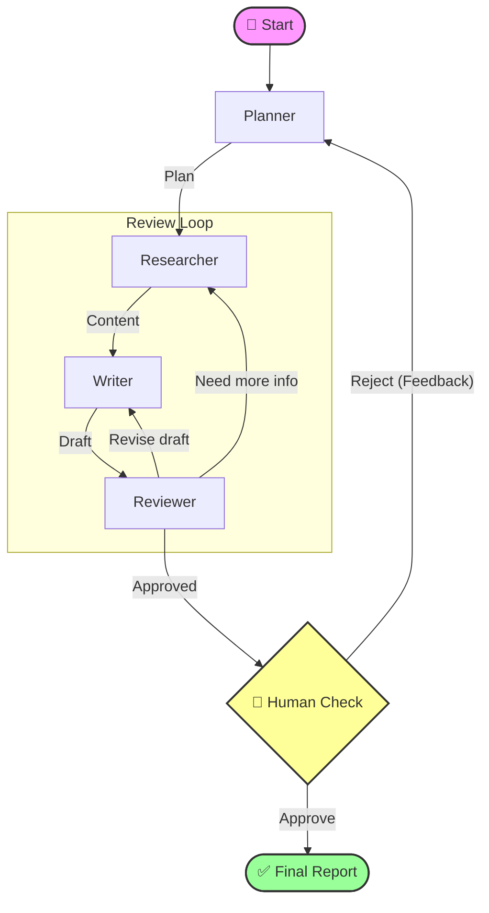

# 🤖 Multi-Agent Deep Industry Research

<div align="center">

[](https://www.python.org/)
[](https://www.langchain.com/langgraph)
[](https://fastapi.tiangolo.com/)
[](https://streamlit.io/)
[](LICENSE)

**Next-Gen Industry Research Assistant Powered by Multi-Agent Collaboration**

[快速开始](#-快速开始) • [核心特性](#-核心特性) • [系统架构](#-系统架构) • [贡献](#-贡献)

</div>

---

## 📖 简介

**Multi-Agent Deep Industry Research** 是一个智能化的行业研究助手，旨在通过 AI 智能体协作，自动化完成从**规划、检索、写作到审核**的全流程。

它不仅仅是一个简单的生成器，更是一个**具备反思能力**的系统。通过 LangGraph 的状态机机制，它能够自我检查、迭代优化，并支持**人在回路 (Human-in-the-loop)**，让专家在关键节点介入，确保产出报告的专业性与准确性。

## ✨ 核心特性

| 特性 | 描述 |
| :--- | :--- |
| **🤖 多智能体协作** | **Planner**（规划）、**Researcher**（检索）、**Writer**（写作）、**Reviewer**（审核）各司其职，模拟真实研究团队的工作流。 |
| **🧠 深度反思机制** | 基于 **LangGraph** 构建状态机，支持循环迭代。Reviewer 可将任务打回给 Writer 重写或 Researcher 补充资料。 |
| **🔄 人在回路 (HITL)** | 关键节点支持人工介入（Approve/Reject），用户可实时反馈意见，引导 Agent 进行针对性修改。 |
| **⚡ 实时流式体验** | 后端采用 **FastAPI SSE** 推送，前端 **Streamlit** 实时展示 Agent 的思考过程、工具调用与中间产物。 |
| **📚 混合检索增强** | 集成 **Tavily Search**（高质量研报源）与 **DuckDuckGo**（广泛搜索），确保信息来源的时效性与广度。 |
| **💾 完备的持久化** | 基于 **SQLite** 的 Checkpoint 机制，支持会话记忆、断点续传与历史版本回溯。 |

## 🏗️ 系统架构

系统采用清晰的微服务架构，前后端分离，确保了扩展性与维护性。

### 🔄 Agent 工作流 (Mermaid)



### 🧱 技术栈架构

- **Agent Layer**: LangGraph, LangChain
- **LLM Layer**: Qwen-max, DeepSeek-V3 (via DashScope)
- **Service Layer**: FastAPI, Uvicorn (Async/SSE)
- **Interface Layer**: Streamlit
- **Data Layer**: SQLite (aiosqlite)

## 🚀 快速开始

### 🛠️ 前置条件

- Python 3.10+
- [DashScope API Key](https://help.aliyun.com/zh/dashscope/developer-reference/activate-dashscope-and-create-an-api-key)
- [Tavily API Key](https://tavily.com/) (可选，推荐)

### 📥 安装与运行

1.  **克隆仓库**

    ```bash
    git clone https://github.com/shihan-1147/Multi-Agent-Deep-Industry-Research.git
    cd Multi-Agent-Deep-Industry-Research
    ```

2.  **安装依赖**

    ```bash
    pip install -r requirements.txt
    ```

3.  **配置环境变量**

    复制 `.env.example` (如果有) 或直接创建 `.env`：

    ```env
    DASHSCOPE_API_KEY=sk-your-api-key
    TAVILY_API_KEY=tvly-your-api-key  # Optional
    ```

4.  **启动服务**

    需要分别启动后端与前端：

    **Backend (Terminal 1)**
    ```bash
    uvicorn backend.main:app --host 0.0.0.0 --port 8000
    ```

    **Frontend (Terminal 2)**
    ```bash
    streamlit run frontend/app.py
    ```

5.  **开始体验**

    打开浏览器访问 `http://localhost:8501`，输入你的研究主题，开启 AI 研究之旅！

## 🗺️ Roadmap

- [x] 基础多智能体流程 (Planner -> Researcher -> Writer -> Reviewer)
- [x] LangGraph 状态机与持久化
- [x] FastAPI 后端与 SSE 流式输出
- [x] Streamlit 交互界面与人工审核
- [ ] **多格式导出**: 支持导出为 PDF, Word, Markdown
- [ ] **更多搜索源**: 集成 Google Search, Bing Search
- [ ] **知识库集成**: 支持 RAG (Retrieval-Augmented Generation) 挂载本地文档
- [ ] **图表生成**: 自动根据数据生成统计图表

## 📂 项目结构

<details>
<summary>点击展开项目目录结构</summary>

```text
.
├── agent/                  # 🤖 Agent 核心逻辑
│   ├── graph.py            # LangGraph 图定义
│   ├── nodes.py            # 节点功能实现
│   ├── prompts.py          # Prompt 模板
│   └── states.py           # 状态定义
├── backend/                # ⚡ FastAPI 后端
│   ├── main.py             # 入口文件
│   └── models.py           # 数据模型
├── frontend/               # 🖥️ Streamlit 前端
│   └── app.py              # UI 实现
├── artifacts/              # 🖼️ 静态资源
├── langgraph.json          # LangGraph 配置文件
├── requirements.txt        # 项目依赖
└── README.md               # 项目文档
```
</details>

## 📈 Star History

[](https://star-history.com/#shihan-1147/Multi-Agent-Deep-Industry-Research&Date)

## 🤝 贡献

欢迎任何形式的贡献！请阅读 [CONTRIBUTING.md](CONTRIBUTING.md) 了解更多细节。

## 📄 许可证

本项目采用 [MIT License](LICENSE) 开源。
